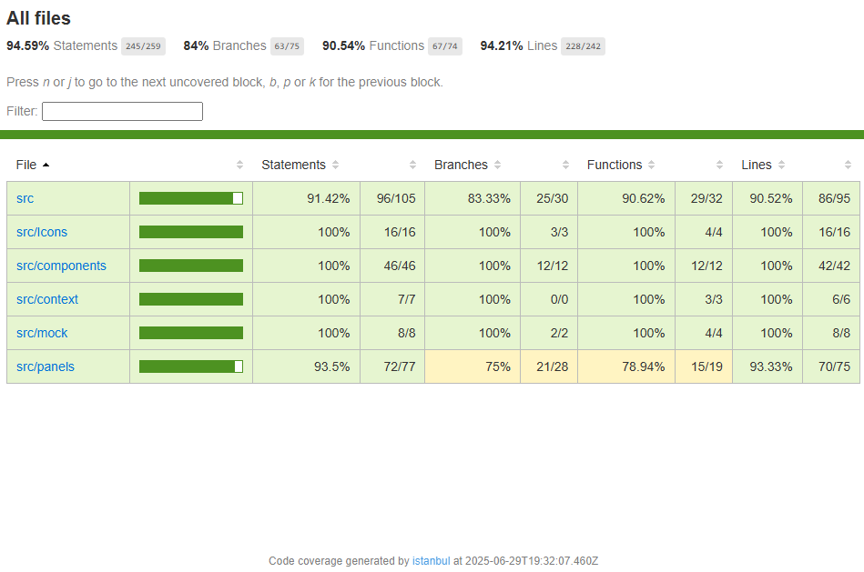

## Technical Questions

1. **How much time did you spend on the engineering task?**

   - 15% debugging dependency issue
   - 30% trying to understand the codebase
   - 10% reading documentation for antd
   - 35% refactoring work
   - 10% unit test?

2. **What would you add to your solution if you’d had more time?**
   - Refactoring all the stying, too many inline styles on the component, and leverage the use of CSS variables for theme toggling.
   - Replacing components/icon that can be replaced with `antd` library
3. **What do you think is the most useful feature added to the latest version of JS/TS?**

   - **Include a code snippet that shows how you've used it.**<br>
     Not necessarily brand new, but I just started to use this 2 years ago.

     ```ts
     // destructuring
     const [state, setState] = React.useState();
     const {
       hard: {
         to: {
           reach: { vars },
         },
       },
     } = someVars;

     // Using Map and Set in JavaScript/TypeScript
     const fruits = new Map<string, number>();
     fruits.set("apple", 10);
     fruits.set("banana", 5);

     const uniqueFruits = new Set<string>();
     uniqueFruits.add("apple");
     uniqueFruits.add("banana");
     uniqueFruits.add("apple"); // Duplicate, will not be added

     console.log(fruits.get("apple")); // 10
     console.log(uniqueFruits.has("banana")); // true
     ```

     Cool thing about `Map` is you are no longer restricted to use `string` as key, it can be an object as well.

4. **How would you track down a performance issue in production?**<br>
   By using inspector tools, typically crashes are easier to track and fix, versus app slowing down or becoming non-responsive over time.
   - **Have you ever had to do this?**<br>
     **For Crashes.**
     Ideally we should have a generic error handler that can track users states in memory, when crash happens, we should be able to get the latest state (or few last step before crash happens) with users consent, for diagnostic. I have never implement it myself, but the idea come across multiple times.<br>
     **Slowing Down**
     Yes, one of the app that we build have memory leaking, and performance issues. Took 3 - 4 developers to figure out the problem by reading cpu, memory usage, and a lot of speculating and guess works.

## Migration Gotchas & Challenges

1. Latest Vite shipped with `React@19`, which turns out to be not playing nicely with `antd`, also we have outdated version of `antd` that needs to be upgraded so it can play well with `React@18`.
2. Intellisense seemingly broken midway of refactoring the whole code, suspect that it broke after configuration changes made for JEST

## Challenge Checklist



### 🍉 Acceptance Criteria

- [x] Upgrade the project to **React 18**.
- [x] Add **unit tests** before you start refactoring. (No squishy bugs allowed!)
- [x] Upgrade all dependencies so they play nicely with React 18 (or 19, if you’re feeling zesty).
- [x] Update both the **light** and **dark** themes—make them so fresh you’ll need sunglasses.
- [x] **Fix the drag and drop for panels**—right now, it’s more slippery than a watermelon seed.
- [x] **Tame the panel resizing**—currently, it’s wilder than a runaway grape.
- [x] **Upgrade the grid/layout** so panels can go horizontal, vertical, or do the cha-cha for better visual combos.
- [x] **Fix the theme switch** (light/dark)—right now, it’s more confused than a kiwi in a fruit salad.

### 🥭 Bonus

- [x] **Migrate from Webpack to Vite:**  
       Swap out the old Webpack setup for [Vite](https://vitejs.dev/) to enjoy lightning-fast hot module reloading and a simpler config.  
       _Tip: Vite works great with React 18+ and will make your dev workflow as snappy as a fresh snap pea!_
- [ ] **Upgrade to React 19:**  
       Take it to the next level by upgrading the project to [React 19](https://react.dev/blog/2024/04/25/react-v19.0.0), and try out the latest features!
- [x] **Implement a real backend for authentication:**  
       Replace the mock frontend authentication with a real backend (Node.js or your favorite language).
  - Create an authentication server (REST or GraphQL) to handle login and user info.
  - Update the frontend to retrieve authentication and user data from the backend instead of mocking it.
- [x] **Extra Credit:**
  - [x] Document any migration steps or gotchas you encounter.
  - [ ] Compare build/start times before and after the migration.
  - [ ] Share your favorite Vite plugin for React projects!
